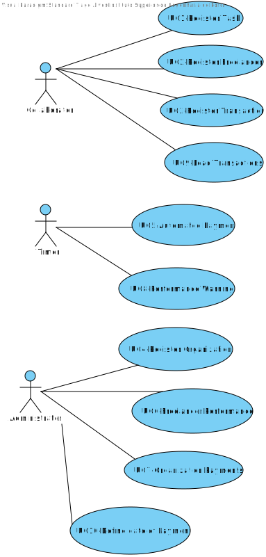

# Use Cases Diagrams

# Use Cases
| UC  | Description                                                               |                   
|:----|:------------------------------------------------------------------------|
| UC1 | [Register Task](UC1_RegisterTask.md)   |
| UC2 | [Register Freelancer](UC2_RegisterFreelancer.md)  |
| UC3 | [Register Transaction](UC3_RegisterTransaction.md)|
| UC4 | [Register Organization](UC4_Register rganization.md)|
| UC5 | [Automated Payment](UC5_AutomatedPayment.md) |
| UC6 | [Freelancer Performance](UC6_FreelancerPerformance.md)|
| UC7 | [Organization Payments](UC7_OrganizationPayments.md)   |
| UC8 | [Perfomance Warning](UC8_PerfomanceWarning.md)  |
| UC9 | [Load Transactions](UC9_LoadTransactions.md)|
| UC10 | [Define date of Payments](UC10_DefineDateOfPayments.md)|
