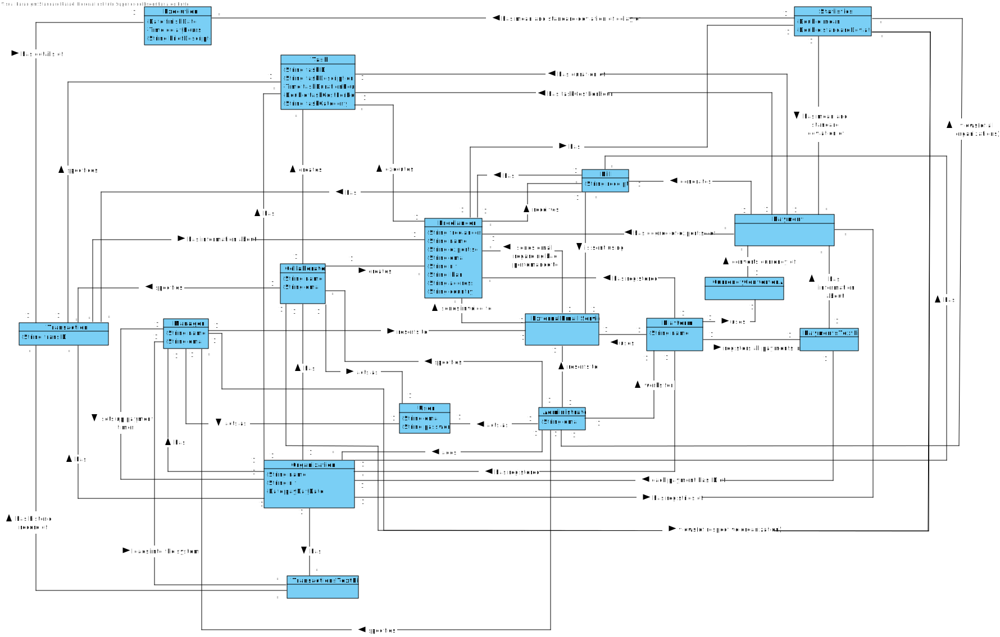

# OO Analysis #

## Rational for identifying domain classes ##

### _Categories List_ ###

**Transactions (of the business)**

* Payments

---

**Transaction lines**

---

**Transaction-related products or services**

*  Task

**Records (of transactions)**

* Registration of all payments in a text file
* Bill

**People's roles**

* Administrator
* Freelancer
* Collaborator (of the Organization)
* Manager (of the Organization)
* User

**Places**

*  Country
*  Address
*  Platform

**Events**

* Transaction
* Payments
* Email warning

**Physical Objects**

---

**Specification and Description**

*  Task

**Catalog**

---

**Sets**

---

**Set Elements**

---

**Organizations**

*  T4J (Company)
*  Organization

**Other systems (external)**

*  User Management Component
*  Currency Conversion
*  Password generation algorithm
*  Email Service

**Records (financial), work, contracts, legal documents**

---

**Financial instruments**

*  Transaction API

**Referred documents to perform the tasks**

---

## Rationale about identifying associations between classes ##

An association is a relationship between instances of objects that indicates a relevant connection and is worth remembering, or is derivable from the List of Common Associations:

+ A is physically (or logically) part of B
+ A is physically (or logically) contained in B
+ A is a description of B
+ A is known / captured / recorded by B
+ A uses or manages B
+ A is related to a B transaction
+ etc.

| Concept (A) 	               |  Association  	          	|  Concept (B)    |
|----------	   	               |:-------------:	           	|------:          |
| Administrator                | works for                    | Platform             |
|						       | acts as		              | User                 |
|                              | resorts to                   | ExternalEmailService |
|                              | adds                         | Organization         |
|                              | views (of all organizations) | Statistics           |
| Manager                      | loads file                 | Transaction     |
|                              | acts as                    | User            |
|                              | view (of respective organization | Statistics |
|                              | resorts to                   | ExternalEmailService |
|                              | sets up payment timer      | Organization    |
| Collaborator		           | acts as		            | User            |
|                              | creates                    | Task            |
|                              | creates                    | Freelancer      |
|                              | registers                  | Transaction     |
|                              | view (of respective organization | Statistics |
| Freelancer			       | executes                   | Task            |
|                              | receives                   | Bill            |
|                              | has                        | Statistics      |
| Platform	                   | has registered             | Organization    |
|						       | has/uses    	       		| Freelancer      |
|                              | registers all payments in  | ExternalEmailService |
|                              | uses                       | CurrencyConverterAPI |
| Organization		           | has                      	| Manager         |
|						       | has	     		        | Collaborator    |
|					           | has		                | Task            |
|                              | has                        | Transaction     |
|                              | has                        | TransactionsTextFile |
|                              | has                        | Bill            |
|                              | has registries of          | Payment         |
| Transaction                  | specifies                  | Task            |
|                              | has information about      | Freelancer      |
|                              | has details of             | Execution       |
| TransactionsTextFile         | has historic record of     | Transaction     |
| ExternalEmailService         | sends email regarding bad performance to | Freelancer |
|                              | sends bill to           | Freelancer |
| Bill                         | has                        | Freelancer |
|                              | is sent using              | ExternalEmailService |
| PaymentsTextFile             | has information about      | Payment   |
| CurrencyConverterAPI         | converts currency of       | Payment   |
| Payment                      | has duration of            | Task      |
|                              | has cost per hour          | Task      |
|                              | has degree of expertise of | Freelancer |
|                              | generates                  | Bill      |
| Statistics                   | has mean and standard deviation of | Execution |
|                              | has mean and standard deviation of | Payment   |

## Domain Model

