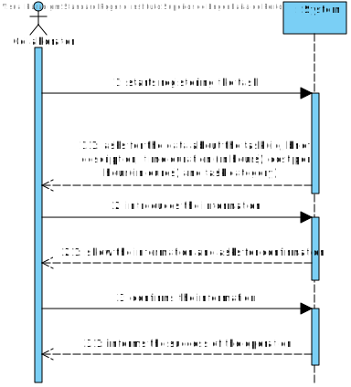
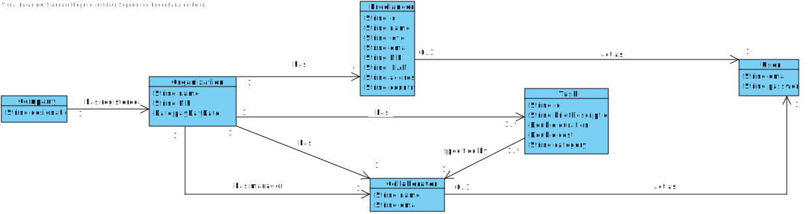
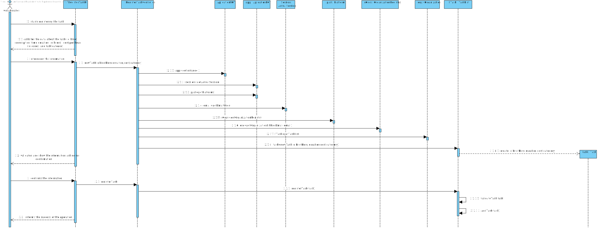
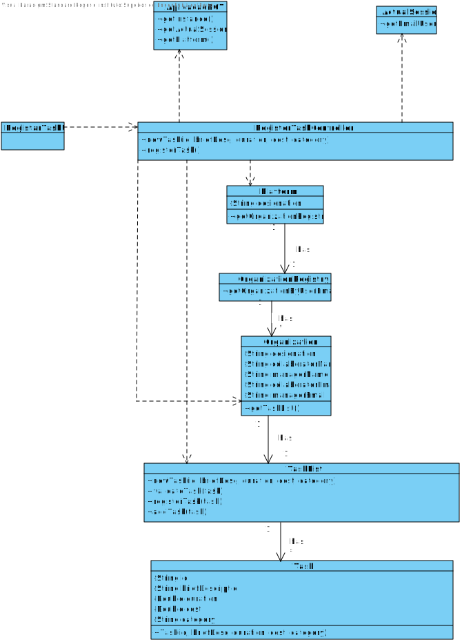

# UC1 - Register Task

## 1. Requirements engineering

### Brief Format

The collaborator starts registering the task. The system asks for the data required about the task (id, brief description, time duration (in hours), cost per hour (in euros) and task category). The collaborator introduces the information. The system validates and show the information asking for confirmation. The collaborator confirms the information. The system informs the success of the operation.

### SSD

### Full Format

#### Main Actor

Collaborator

#### Stakeholders and their interests

* **Collaborator:** pretend to specify the tasks with its description.
* **Organization:** pretend to have the tasks registered and being executed.
* **T4J:** save the information about the task for the transactions.

#### Preconditions

\-

#### Postconditions

The information about the task is registered in the system.

### Main success scenario (or basic flow)

1. The collaborator starts registering the task. 
2. The system asks for the data required about the task (id, brief description, time duration (in hours), cost per hour (in euros) and task category). 
3. The collaborator introduces the information. 
4. The system validates and show the information asking for confirmation. 
5. The collaborator confirms the information. 
6. The system informs the success of the operation.

#### Extensions (or alternative flows)

*a. The collaborator asks to cancel the registration of the task.

> The use case ends.

4a. The system detects required information not filled.
>	1. The system informs what is missing.
>	2. The system allows the introduction of the information. (step 3)
>
	>	2a. The collaborator doesn't fill the information. The use case ends.

4b. The system detects that some information must be unique and it already exists on the system.
>	1. The system alerts the collaborator of that.
>	2. The system allows the changing of the information. (step 3)
>
	>	2a. The collaborator doesn't fill the information. The use case ends.

4c. The system detects invalid information.
> 1. The system alerts the collaborator of that. 
> 2. The system allows the changing of the information. (step 3).
> 
	> 2a. The collaborator doesn't fill the information. The use case ends.

#### Special requirements

\-

#### List of Technologies and Data Variations

\-

#### Frequency of Occurrence

\-

#### Open questions

\-

## 2. OO Analysis

### Excerpt from the Relevant Domain Model for UC

## 3. Design - Use Case Realization

### Rational

| Main Flow | Question: which class... | Answer  | Justification  |
|:--------------  |:---------------------- |:----------|:---------------------------- |
| 1. The collaborator starts registering the task.	 |	... interacts with the user? | RegisterTaskUI |  Pure Fabrication, it is not justified to assign this responsibility to any existing class in the Domain Model. |
|  		 |	... coordinates the UC?	| RegisterTaskController | Controller    |
|  		 |	... creates instance Task? | TaskList | Creator (Rule1) + HC / LC: in the MD the Organization has a Task. By HC / LC delegates these responsibilities in TaskList.   |
| 2. 2. The system asks for the data required about the task (id, brief description, time duration (in hours), cost per hour (in euros) and task category) and about the execution (end date, delay, brief description of the quality of the work).   		 |							 |             |                              |
| 3. The collaborator introduces the information.  		 |	... stores the inserted data about the Task?  |   Task | Information Expert (IE) - instance created on step 1. Has its own data. |
| 4. The system validates and show the information asking for confirmation.   | ...validates the data of the Task? (local validation)? | Task | IE. Has its own data. |
| |	...validates the data of the Task? (global validation)? | TaskList  | IE: TaskList has Task.  |
| 5. The collaborator confirms the information.   		 |							 |             |                              |
| 6. The system informs the success of the operation.  		 |	...stores the created Task? | TaskList  | IE: TaskList has Task. |  

### Systematization ##
 
It follows from the rational that the conceptual classes promoted to software classes are:

 * Task
 * Organization

Other software classes (i.e. Pure Fabrication) identified:  

 * RegisterTaskUI  
 * RegistarTaskController
 * TaskList

###	Sequence Diagram

###	Class Diagram

