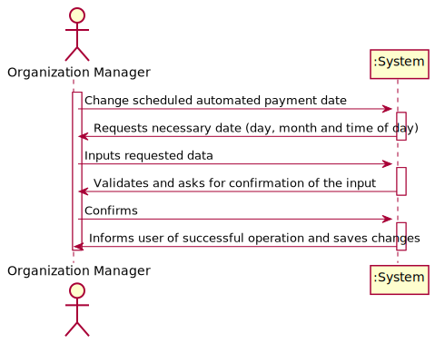
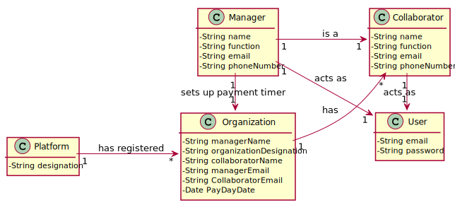
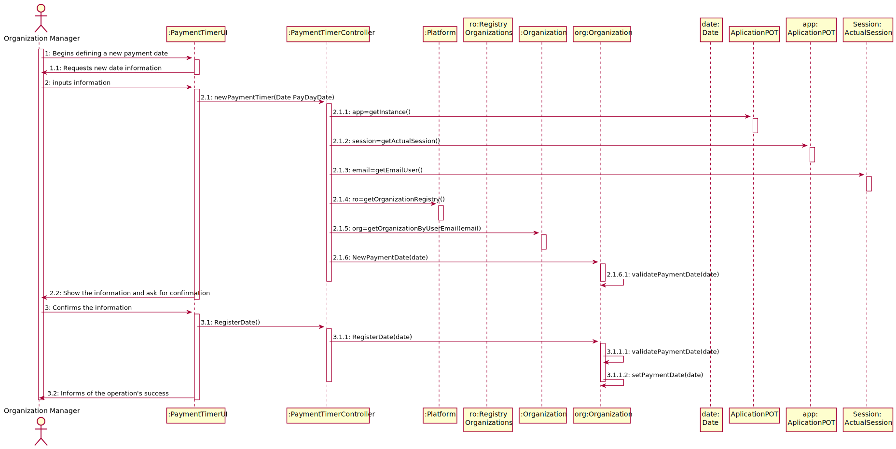
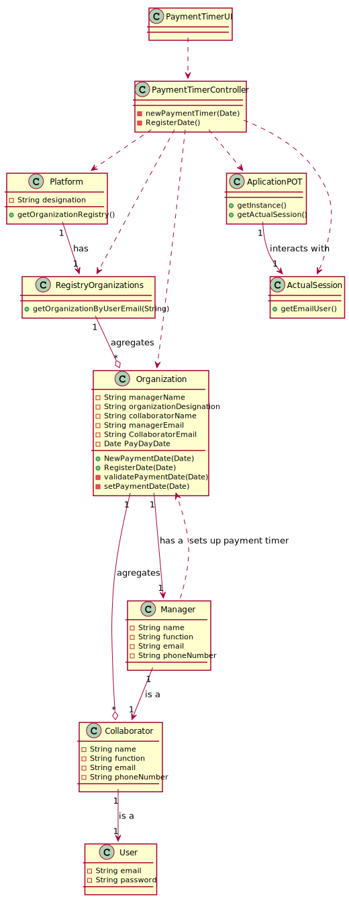

# UC10 - Define Date of Payments

## 1. Requirements Engineering

### Brief Format

The Organization's manager starts the process of changing the scheduled automated payment day. The system requests the necessary data (i.e day, month and hour of the day). The manager submits the requested information. The system validates and asks the manager for confirmation. The manager confirms his input. The system saves the new automated date.

### SSD

### Fully Dressed Format

#### Primary actor

* Organization manager

#### Interested parties and their interests
* **Organization manager:** register a new pay day.
* **Organization:** wants to have a designated pay day.

#### Preconditions
n/a

#### Postconditions
The new date is saved in the system, and is implemented in the payment system.

#### Main success scenario (or basic flow)

1. The user initiates the change of the scheduled payment date.
2. The system shows him the current date and asks for the new date information (day, month and time of day).
3. The user inputs his new desired date.
4. The system validates and asks the user for confimation over his input.
5. The user confirms.
6. The system saves the new date and informs the user of the success of the operation.

#### Extensions (or alternative flows)

a. The manager asks for the cancelation of the operation.

> The use case ends.

4a. The system detects that the date entered is the same as the current date set onto the organization.
>	1. The system informs the manager of such.
>	2. The system allows you to change it (Step 3).
>
	>	2a. The manager doesn't change it; the use case ends.

4b. The system detects that the date entered has missing information or is incomplete.
>	1. The system informs the manager of such.
>	2. The system allows you to change it (Step 3).
>
	>	2a. The manager doesn't change it; the use case ends.

4c. The system detects that the entered date is invalid.
>	1. The system informs the manager of such.
>	2. The system allows you to change it (Step 3).
>
	>	2a. The manager doesn't change it; the use case ends.

#### Special Requirements
\-

#### List of Technolagies and Data Variations
\-

#### Occurance Frequency
\-

#### Open Questions
\-

## 2. OO Analysis

### Excerpt from the Relevant Domain Model for UC

## 3. Design - Use Case Realization

### Rationale

| Main Flow | Question: What Class ... | Answer  | Justification  |
|:--------------  |:---------------------- |:----------|:---------------------------- |
|1. The user initiates the change of scheduled payment day| ... interacts with the user? | PaymentTimerUI | Pure Fabrication, there are no suitable classes in the Domain Model to attribute this responsability to. |
| | ... coordinates the UC? | PaymentTimerController | Controller |
| | ... changes the payment date?| Organization | Registers the date of payment. |
|2. The system shows the current date and asks for the new date information. | | | |
|3. The user inputs the new date information. | ... stores the introduced date? | Organization | |
|4. The system validates and shows the information to the user, waiting his confirmation. | ... validates the user's input? | Organization | IE.: Has the last date scheduled|
|5. The user confirms the information. | | | |
|6. The system informs of the success of the operation. | ... stores the new scheduled date? | Organization | IE.: Organization has a payment timer with a scheduled date for payment each month|

### Systematization ##

From rational follow the conceptual classes promoted to software classes are:

 * Platform
 * Organization
 * Collaborator
 * Manager

Other software classes (i.e. Pure Fabrication) identified:

 * PaymentTimerUI
 * PaymentTimerController

###	Sequence Diagram

###	Class Diagram

