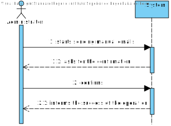
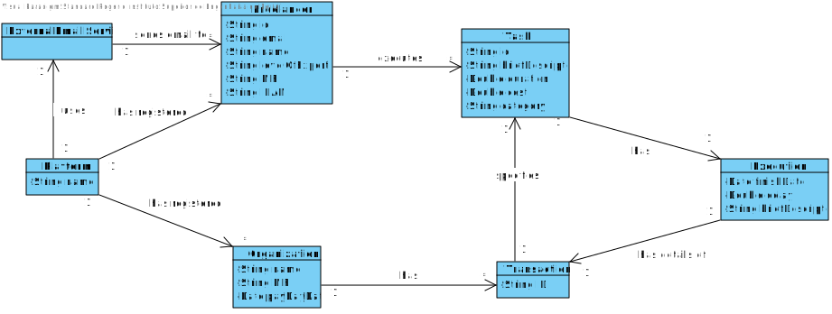
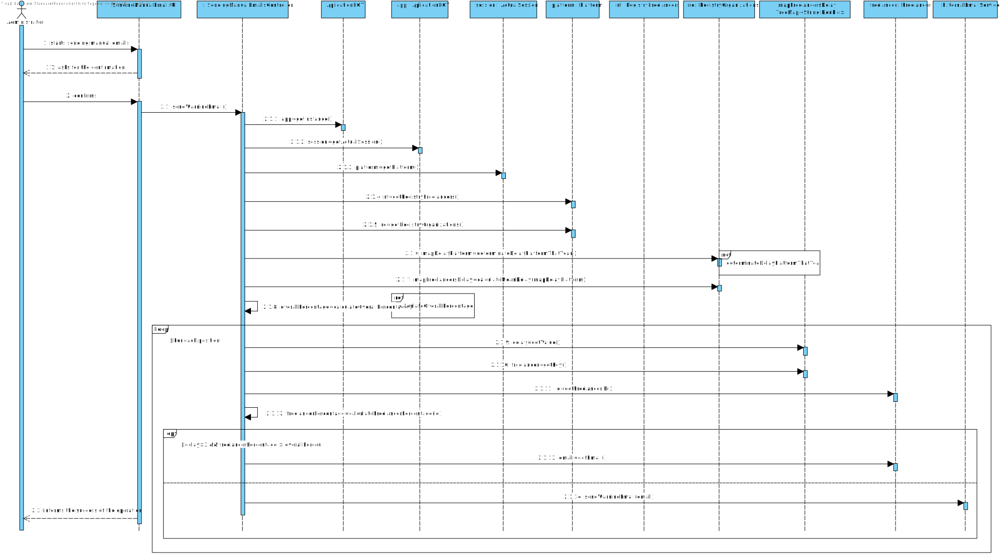
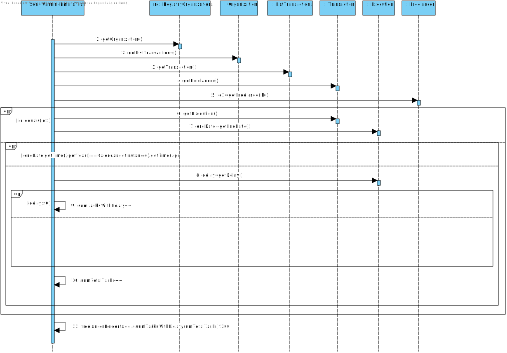
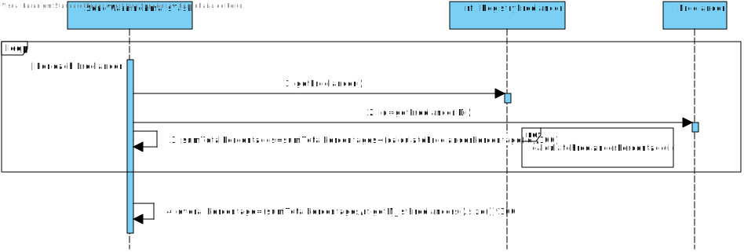
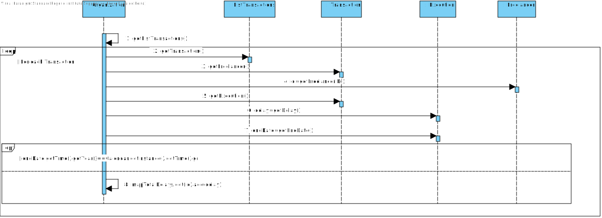
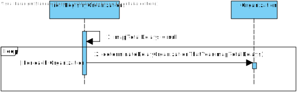
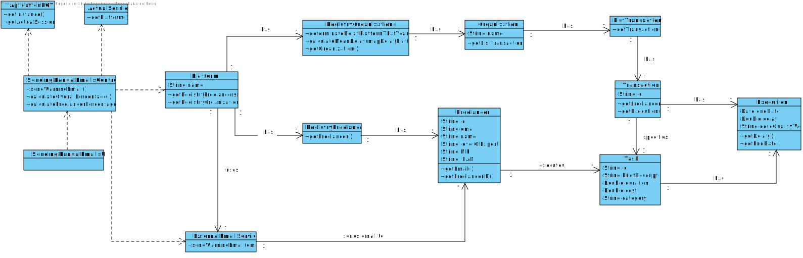

# UC11 - Send Manual Emails

## 1. Requirements engineering

### Brief Format

The Administrator starts sending manual emails. The system asks for the confirmation. The administrator confirms. The system sends the emails and informs the success of the operation.

### SSD

### Full Format

#### Main Actor

Administrator

#### Stakeholders and their interests

* **Administrator:** pretends to warn the freelancers of their bad performance.
* **T4J:** pretends to the administrator send an email, whenever he wants.

#### Preconditions

\-

#### Postconditions

\-

### Main success scenario (or basic flow)

1. The Administrator starts sending manual emails. 
2. The system asks for the confirmation.
3. The administrator confirms. 
4. The system sends the email and informs the success of the operation.

#### Extensions (or alternative flows)

*a. The administrator asks to cancel the sending manual emails.

> The use case ends.

#### Special requirements

\-

#### List of Technologies and Data Variations

\-

#### Frequency of Occurrence

\-

#### Open questions

\-

## 2. OO Analysis

### Excerpt from the Relevant Domain Model for UC

## 3. Design - Use Case Realization

### Rational

| Main Flow | Question: which class... | Answer  | Justification  |
|:--------------  |:---------------------- |:----------|:---------------------------- |
| 1. The Administrator starts sending manual emails.	 |	... interacts with the user? | SendingManualEmailsUI |  Pure Fabrication, it is not justified to assign this responsibility to any existing class in the Domain Model. |
|  		 |	... coordinates the UC?	| SendingManualEmailsController | Controller    |
| 2. The system asks for the confirmation. | | | |
| 3. The Administrator confirms. | ... knows the Freelancers? | Platform | IE: on MD Platform has Freelancer. |
| |	 | RegistryFreelancers | IE: by HC + LC Platform delegates RegistryFreelancers. |
| | | Freelancer |  IE: has its own data. |
| | ... knows the RegistryFreelancers? | Platform | IE: Platform has RegistryFreelancers. |
| | ... knows the Organizations? | Platform | IE: on MD Platform has Organization. |
| | | RegistryOrganizations | IE: by HC + LC Platform delegates RegistryOrganizations. |
| | | Organization | IE: has its own data. |
| | ... knows the RegistryOrganizations? | Platform | IE: Platform has RegistryOrganizations. |
| | ... knows the Transactions? | Organization | IE: on MD Organization has Transaction. |
| | | ListTransactions | IE: by HC + LC Organization delegates ListTransactions. |
| | | Transaction | IE: has its own data. |
| | ... knows the Executions? | Transaction | IE: on MD Transaction has Execution. |
| | | Execution | IE: has its own data. |
| | ... sends the email? | ExternalEmailService | Protected Variation |
| 4. The system sends the email and informs the success of the operation. | | | |
           

### Systematization ##
 
It follows from the rational that the conceptual classes promoted to software classes are:

 * Platform
 * Freelancer
 * Organization
 * Transaction
 * Execution

Other software classes (i.e. Pure Fabrication) identified:  

 * SendingManualEmailsUI
 * SendingManualEmailsController
 * RegistryFreelancers
 * RegistryOrganizations
 * ListTransactions
 
 Other classes of external systems / components:

 * ExternalEmailService

###	Sequence Diagram

### Reference calculateFreelancerPercentage(id)

### Reference calculateOverallPercentage()

### Reference determinateDelayOrganizationThatYear()

### Reference determinateDelayPlatformThatYear()

###	Class Diagram

