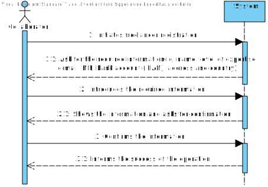
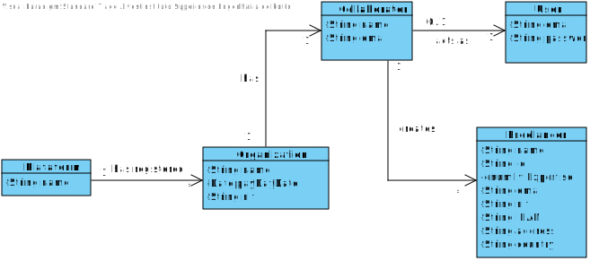
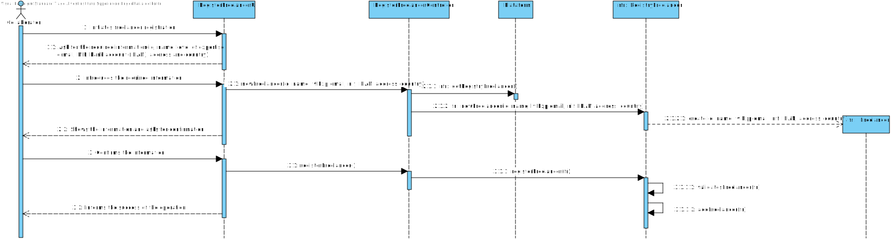
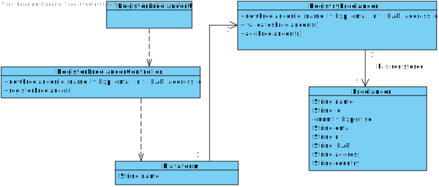

# UC2 - Register Freelancer

## 1. Requirements Engineering

### Brief Format

 The Collaborator initiates freelancer registration. The System asks for the required information(id, name, level of expertise,e-mail, NIF, bank account (IBAN), address and country). The Collaborator introduces the required Information.
 The system shows the information and asks for confirmation. The collaborator confirms the information. The system informs the success of the operation.
### SSD

### Full Format

#### Main Actor

Collaborator

#### Interested parts and their interests
* **Collaborator:** pretends to register a new freelancer.
* **T4J:** acquire a new freelancer.

#### Preconditions
n/a

#### Postconditions
A new freelancer is registred in the system.

### Main success scenario (or basic flow)

1. The Collaborator initiates freelancer registration.
2. The System asks for the required information(id, name, level of expertise,e-mail, NIF, bank account (IBAN), address and country).
3. The Collaborator introduces the required Information.
4. The system shows the information and asks for confirmation.
5. The collaborator confirms the information.
6. The system informs the success of the operation.

#### Extensions (or alternative flows)

a. Collaborator asks for cancelation of the freelancer resgistry

> Use Case ends.

4a. Minimal data missing.
>	1. The system informs you which data is missing.
>	2. The system allows you to enter the missing data (step 3).

>
	>	2a. The collaborator does not change the data. The use case ends.

4b. The system detects that the data (or some subset of the data) entered must be unique and that it already exists in the system.
>	1. The system alerts the collaborator.
>	2. The system allows you to change it. (step 3)
>
	>	2a. The collaborator does not change the data. The use case ends.

4c. The system detects that the entered data (or some subset of the data) is invalid.
> 1. The system alerts the collaborator.
> 2. The system allows you to change it. (step 3)
>
	> 2a. The collaborator does not change the data. The use case ends.

#### Special Requirements
\-

#### List of Technolagies and Data Variations
\-

#### Occurance Frequency
\-

#### Open Questions

## 2. OO Analysis

### Excerpt from the Relevant Domain Model for UC

## 3. Design - Use Case Realization

### Rational

| Main Flow     | Question: What Class ... | Answer  | Justification  |
|:--------------  |:---------------------- |:----------|:---------------------------- |
| 1. The Collaborator initiates freelancer registration.   		 |	... interacts with the collaborator? | RegisterFreelancerUI    |  Pure Fabrication, there are no suitable classes in the Domain Model to attribute this responsability to. |
|  		 |	... coordinates the UC?	| RegisterFreelancerController | Controller    |
|  		 |	... creates instances of Freelancer?| ResgistryFreelancer   | Creator (Rule1) with HC+LC on Plataform   |
| 2. The System asks for the required information(id, name, level of expertise,e-mail, NIF, bank account (IBAN), address and country).  		 |							 |             |                              |
| 3. The Collaborator introduces the required Information.		 |	... stores the introduced data?  |   Freelancer | Information Expert (IE) - instance created in step 1     |
| 4. The system shows the information and asks for confirmation.   		 |	...validates the data of the Freelancer? (local validation)? | Freelancer |                              |IE. Has his own information .|  	
|	 |	... validates the data of the Freelancer(glocal validation)? | ResgistryFreelancer  | IE: ResgistryFreelancer has registed Freelancer  |
| 5. The collaborator confirms the information.   		 |							 |             |                              |
| 6. The system informs the success of the operation..  		 |	... stores the new Freelancer? | ResgistryFreelancer  | IE: Organization has Freelancer|  

### Systematization ##

From rational follow the conceptual classes promoted to software classes are:

 * Plataform
 * Freelancer

Other software classes (i.e. Pure Fabrication) identified:  

 * RegisterFreelancerUI
 * RegisterFreelancerController
 * ResgistryFreelancer

###	Sequence Diagram

###	Class Diagram

