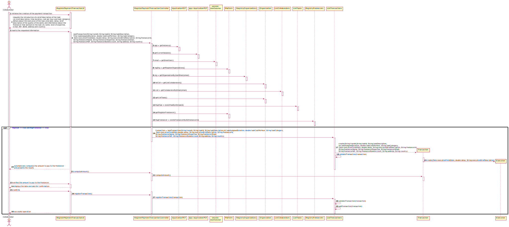

# UC3 - Register Payment Transaction

## 1. Requirements Engineering

### Brief Format

The Collaborator initiates the creation of the payment transaction.
The System requests the introduction of a brief description of the task (id, brief description, time duration, cost per hour and task category), details about the execution of the task (end date, delay, brief description of the quality of the work) and information about the freelancer that worked on the task (id, name, level of expertise, e-mail, NIF, IBAN, address and country).
The Collaborator inserts the requested information.
The System validates, displays the data and asks for confirmation.
The Collaborator confirms.
The System records data about the payment transaction.

### SSD

### Fully Dressed Format

#### Primary Actor

Collaborator

#### Stakeholders and Interests

* **Collaborator:** wants to create a payment transaction for each finished task.
* **Freelancer:** wants to receive his/her payment for the execution of the task.
* **T4J administrator:** wants to manage payments made by organizations to freelancers

#### Pre-Conditions

* The Collaborator of the Organization can only add transactions that are associated to tasks and freelancers that already exist in the system.

#### Post-Conditions

* The transaction is registered in the system.

#### Main Success Scenario (or basic flow)

1. The Collaborator initiates the creation of the payment transaction.
2. The System requests the introduction of a brief description of the task (id, brief description, time duration, cost per hour and task category), details about the execution of the task (end date, delay, brief description of the quality of the work) and information about the freelancer that worked on the task (id, name, level of expertise, e-mail, NIF, IBAN, address and country).
3. The Collaborator inserts/enters the requested information.
4. The System automatically computes the amount to pay to the freelancer and shows it to the Collaborator.
5. The Collaborator verifies the amount to pay to the freelancer.
6. The System validates, displays the data and asks for confirmation.
7. The Collaborator confirms.
8. The System records data about the payment transaction.

#### Extensions (or alternative flow)

*a. The Collaborator requests to cancel the registration.

> The use case ends.

6a. The freelancer described doesn't exist in the system.
>	The system informs which data is missing
>	2. The system allows the definition of a new freelancer (UC2)
>
	>	2a. The Collaborator does not change the data. The use case ends.

6b. The task described doesn't exist in the system.
>	The system informs which data is missing
>	2. The system allows the definition of a new task (UC1)
>
	>	2a. The Collaborator does not change the data. The use case ends.

6c. Missing minimum required data.
> 1. The system informs which data is missing.
> 2. The system allows the entry of missing data (step 3)
>
    > 2a. The collaborator does not change the data. The use case ends.

#### Special Requirements

#### Technology and Data Variations List

#### Frequency of Occurrence

#### Open Questions

(lista de questões em aberto, i.e. sem uma resposta conhecida.)

## 2. Analysis OO

### Excerpt from the relevant Domain Model for the Use Case

## 3. Design - Use Case Realization

### Rational

| Main Flow | Question: Which Class... | Answer  | Justification  |
|:--------------  |:---------------------- |:----------|:---------------------------- |
| 1. The Collaborator initiates the creation of the payment transaction. |...interacts with the collaborator? | RegisterPaymentTransactionUI | Pure Fabrication, because it is not justified to assign this responsibility to any class that exists in the Domain Model. |
|              |...coordinates the UC? |  RegisterPaymentTransactionController | Controller|
|              |...knows the user / collaborator using the system? | UserSession | IE: user management component.
|              |...creates intances of Transaction? | ListTransaction | By the application of the Creator (R1) it would be the Organization. But by applying HC + LC, the Organization delegates that responsibility to the ListTransaction|
|              |...knows ListTransaction? | Organization | IE: According to the MD, the Organization has Transaction |
| 2. The System requests the introduction of a brief description of the task (id, brief description, time duration, cost per hour and task category), details about the execution of the task (end date, delay, brief description of the quality of the work) and information about the freelancer that worked on the task (id, name, level of expertise, e-mail, NIF, IBAN, address and country). | | | |
| 3. The Collaborator inserts the requested information. | ...saves the inserted data? | Transaction | IE: instance created in step 1 |   
|   |...knows the brief description of the task? | Task | IE: has its own data |
|   |...knows the details about the execution? | Execution | IE: has its own data |
|   |...knows the information about the freelancer? | Freelancer | IE: has its own data |
| 4. The System automatically computes the amount to pay to the freelancer and shows it to the Collaborator. |...automatically computes the amount to pay?| Transaction | IE: has its own data |
| 5. The Collaborator verifies the amount to pay to the freelancer.		 | | | |
| 6. The System  validates, displays the data and asks for confirmation. |...validates the Transaction data (local validation)? | Transaction | IE: has its own data |
|                |...validates the Transaction data (global validation)? | ListTransaction | IE: In MD the Organization has Transaction |
| 7. The Collaborator confirms.	 | | | |              
| 8. The System records data about the payment transaction. | ...saves the created Transaction? | ListTransaction | By the application of the Information Expert it would be the Organization. But by applying HC + LC, the Organization delegates that responsibility to the ListTransaction |    
|                | ...knows ListTransaction? | Organization | IE: According to the MD, the Organization has Transaction |

### Systematization ##

From the rational results that the conceptual classes promoted to software classes are:

 * Transaction
 * Task
 * Execution
 * Freelancer
 * Organization

Other software classes(i.e. Pure Fabrication) identified:  

 * RegisterPaymentTransactionUI  
 * RegisterPaymentTransactionController
 * RegistryOrganizations
 * ListTasks
 * RegistryFreelancer
 * ListTransactions

Other system classes / external components:

* UserSession

###	Sequence Diagram

###	Classes Diagram

