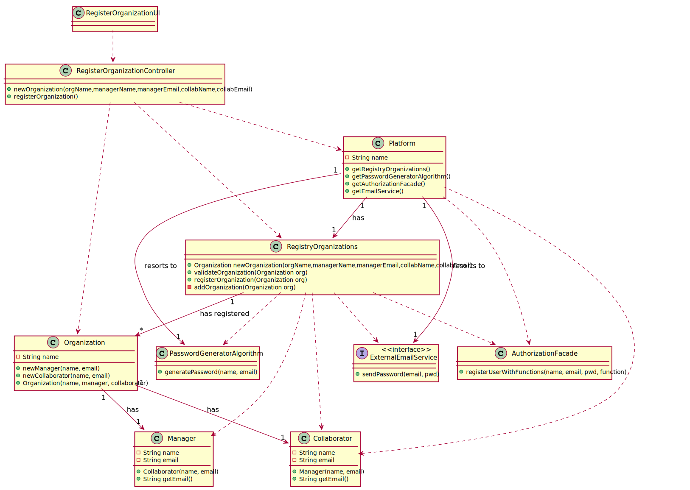

# UC 04 - Register Organization

## 1. Requirements Engineering

### Brief Format

The administrator begins the addition of a new organization.
The system requests the necessary data of the organization(name and NIF), of the manager(name and email) and of the collaborator(name and email).
The administrator inserts the data.
The system presents the data and requests confirmation.
The administrator confirms the data.
The system informs of the success of the operation.

### SSD

### Fully Dressed Format

#### Primary Actor

* Administrator

#### Stakeholders and Interests

* **Administrator:** intends to register the organization, including its manager and collaborator, so they both can use the platform.
* **T4J:** intends that the organization in question is able to use the platform.
* **Organization:** intends to use the platform.
* **Collaborator:** intends to use the platform.

#### Preconditions

- n/a

#### Success Guarantees

- The information about the new organization, among its manager and collaborator, is registered in the system.

#### Main Success Scenario

1. The administrator begins the addition of a new organization.
2. The system requests the necessary data of the organization(name and NIF), the necessary data of the manager(name and email) and of the collaborator of the organization(name and email).
3. The administrator inserts the data.
4. The system validates and presents the data, requesting confirmation.
5. The administrator confirms the data.
6. The system registers the data of the organization and of its manager and collaborator, making these last two
registers users, by sending them their respective passwords(system generated) by email and informs the administrator of the success of the operation.

#### Extensions

*a. The administrator requests the cancellation of the register of the organization and its manager and collaborator.
> The use case ends.

4a. System detects that the inserted NIF of the organization must be unique and that already exist on the system.
>	1. The system alerts the administrator for such fact.
>	2. The system allows its changes (step 3).
>	
	> 2a. The administrator doesn't change the data. Use case ends.

4b. System detects that the inserted email of the manager or collaborator must be unique and that already exist on the system.
>	1. The system alerts the administrator for such fact.
>	2. The system allows its changes (step 3).
>	
	> 2a. The administrator doesn't change the data. Use case ends.
	
4c. Required data missing.
>	1. The system alerts the administrator for such fact.
>	2. The system allows its changes (step 3).
>	
	> 2a. The administrator doesn't change the data. Use case ends.	
	
#### Special Requirements

\-

#### Technology and Data Variations List

\-

#### Frequency of Occurrence

\-

#### Miscellaneous

- Is there other mandatory data besides the one already known?
~~- How is the password generated (use of API to generate password)?~~  
~~- How do the manager and the collaborator of the organization know when the accounts are created?~~  
~~- How do the manager and the collaborator of the organization know their login information?~~
- Is it required the existence of an additional security mechanism to confirm that the organization exists?
- What's the frequency of occurrence of this use case?

## 2. OO Analysis

### UC Relevant Domain Model Excerpt

## 3. Design - Use Case Realization

### Rationale

| Main Flow | Question : Which class... | Answer  | Justification  |
|:--------------  |:---------------------- |:----------|:---------------------------- |
|1.The administrator begins the addition of a new organization.| ...interacts with the administrator? | RegisterOrganizationUI | Pure Fabrication : there are no suitable classes in the Domain Model to attribute this responsibility to.|
||... coordinates the use case? | RegisterOrganizationController | Controller |
||... creates instances of Organization? | RegistryOrganizations | By application of Creator(rule 1) it would be the Platform. But, by the application of High Cohesion(HC) plus Low Coupling(LC), Platform delegates this responsibility on to "RegistryOrganization". |
|| ... knows RegistryOrganizations? | Platform | IE+HC+LC: Platform knows RegistryOrganizations. |
|2.The system requests the necessary data of the organization(name), the necessary data of the manager(name, function and email) and of the collaborator of the organization(name, function and email).||||
|3.The administrator inserts the data.| ... stores the inserted data? |Organization, Manager, Collaborator|IE: instance created in step 1|
|| ... creates instances of Collaborator(manager)? | Organization | Creator(rule 1). |
|| ... creates instances of Collaborator(collaborator)? | Organization | Creator(rule 1). |
|4.The system validates and presents the data, requesting confirmation.| validates the data of the Organization? (local validation)? | Organization |IE: has its own data.|
|| ... validates the data of the Collaborator(local validation)? | Collaborator |IE: has its own data.|
|| ... validates the data of the Organization? (global validation)? | RegistryOrganizations | IE: RegistryOrganizations has registered Organizations. |
|5.The administrator confirms the data.|||
|6.The system registers the data of the organization and of its manager and collaborator, making these last two registers users, by sending them their respective passwords(system generated) by email and informs the administrator of the success of the operation.| ... stores the created Organization? | RegistryOrganizations | IE: By application de HC+LC to the Platform. |
|| ... generates the password? | PasswordGeneratorAlgorithm | Pure Fabrication |
|| ... registers/stores the users relative to the manager and the collaborator? | AuthorizationFacade | IE: The user management is the responsibility of the respective external component  whose point of interaction is through the class "AuthorizationFacade".|
|| ... sends the email to the manager and collaborator? | ExternalEmailService | Protected Variation. |

### Sistematization

 Of the rationale it results that the conceptual classes promoted to software classes are:

 * Platform
 * Organization
 * Collaborator
 * ExternalEmailService

 Other software classes(i.e. Pure Fabrication) identified:  

 * RegisterOrganizationUI
 * RegisterOrganizationController
 * RegistryOrganizations
 * AuthorizationFacade(of the user management component)
 * PasswordGeneratorAlgorithm

###	Sequence Diagram

#### UC4_SD_RegisterManagerAndCollaboratorAsUsers

###	Class Diagram

#### UC4_CD_SendEmail

