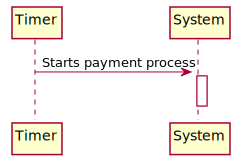
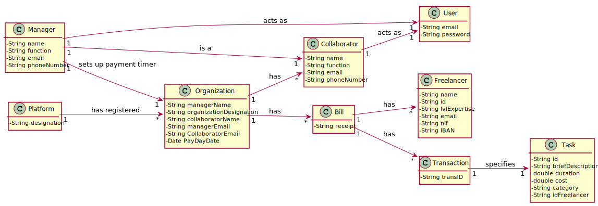
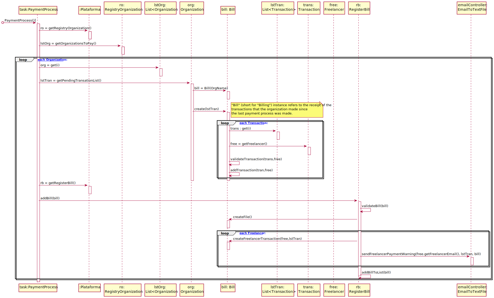
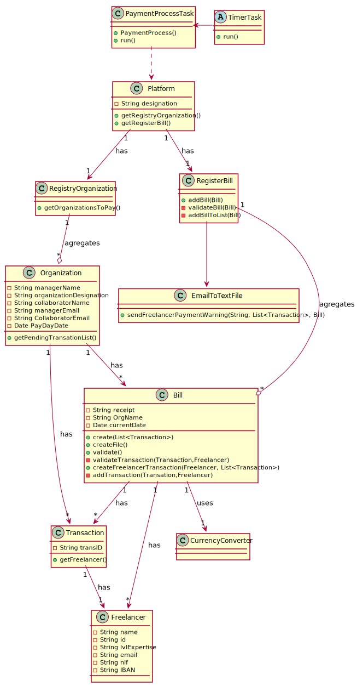

# UC5 - Automated Payments

## 1. Requirements Engineering

### Brief Format

The system starts the payment process automatically, according to the set payment date. The payment process starts. The transactions pending are done to their respective freelancers as well as the emails with their respective receipts. All the transactions are saved.

### SSD

### Fully Dressed Format

#### Primary actor

* Timer

#### Interested parties and their interests

* **Organization Manager:**
* **Organization:** wants to automatically pay their workers in an easy and umcomplicated process.
* **Freelancer:** wants to have a fixed date that he knows he's going to get paid by.
* **T4J:** wants to register every transaction made within the application and also wants to make whole payment process more streamline and easy to understand, so that both organizations and freelancers have a focus on their work rather than how they're going to pay/get paid.

#### Preconditions
There must be a date of payment set in the organization.

#### Postconditions
The finished transactions must be registered in the platform.

#### Main success scenario (or basic flow)

1. The **timer** starts the process of payment automatically.
2. The system registers the transactions made.

#### Extensions (or alternative flows)

1a. There are no payments pending since the last payment date.
 > The use case is terminated.

#### Special Requirements
\-

#### List of Technolagies and Data Variations
\-

#### Occurance Frequency
Every month on the pre-set date.

#### Open Questions
\-

## 2. OO Analysis

### Excerpt from the Relevant Domain Model for UC

## 3. Design - Use Case Realization

### Rationale

| Main Flow | Question: What Class ... | Answer  | Justification  |
|:--------------  |:---------------------- |:----------|:---------------------------- |
|1. The **timer** starts the process of payment automatically. | ...coordinates the UC? | Organization | I.E.: Has the transaction information. |
|| ... creates the transaction instance? | RegisterTransaction | Creator (rule 1): RegisterTransaction cointains transaction. |
|| ... creates the Timer instance? | Organization | Creator (rule 3): Organization has the necessary data to start up the timer. |
|| ... represent the task being executed? | PaymentProcess | PureFabrication. |
|| ... represent the time frame of the task? | Timer ||
|| ... knows the pending transactions? | Platform | I.E.: Platform has RegisterTransaction. |
||                                     | RegisterTransaction | HC + LC : delegates the transaction list.|
|| ... knows the freelancer from the transaction? | Transaction | I.E.: has the information about its freelancer.|
|| ... creates a new automatic payment process? | Organization | Creator (rule 3): has the necessary information to start the payment process.|
|| ... creates a new payment for the payment process?| Bill | Creator (rule 1): the bill is where all the payment information is processed. |
|| ... validates a payment? | Bill | I.E.: has the transaction information. |
|| ... locally validates the bill? | Bill | I.E.: The bill has its own data. |
|| ... globally validates the bill? | RegisterBill | I.E.: Has the bill. |
|| ... defines the PaymentProcess? | Organization | I.E.: Has the PaymentProcess information. |
|2. The system registers the completed transactions.  | ... registers the PaymentProcess? | Platform | I.E.: Has the RegisterBill. |
||| RegisterBill | I.E.: Has all previous bill instances registered. |
|| ... registers the transactions completed? | Platform | I.E.: Stores the history of transactions made. |

### Systematization ##

From rational follow the conceptual classes promoted to software classes are:

 * Platform
 * Organization
 * Freelancer
 * Transaction
 * Bill

Other software classes (i.e. Pure Fabrication) identified:

 * RegistryOrganization
 * RegisterBill
 * RegisterTransaction
 * PaymentProcess

###	Sequence Diagram

###	Class Diagram

