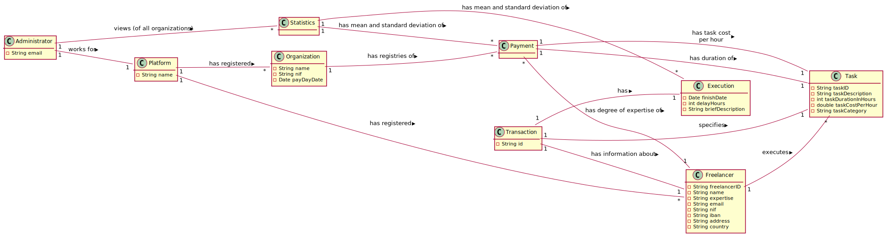
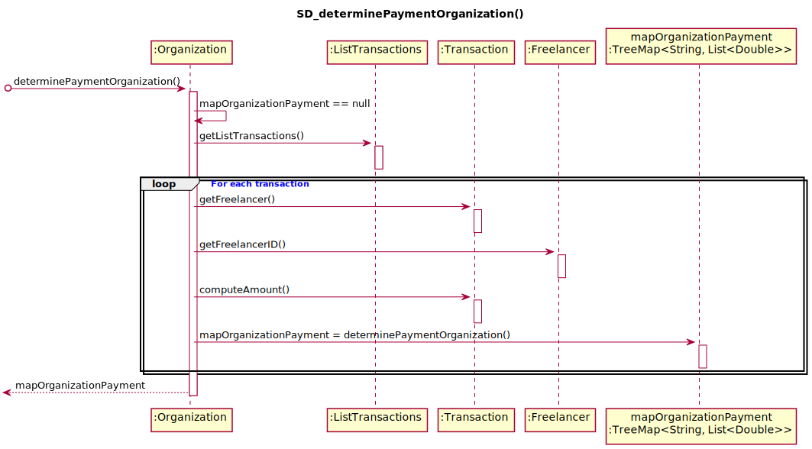

# UC6 - Show Freelancer Performance Statistics

## 1. Requirements Engineering

### Brief Format

The T4J Administrator initiates the process of viewing freelancers performance statistics.
The System computes and shows freelancers performance statistics (i.e. the mean and the standard deviation of delays and payments along with histograms of each one and all freelancers).
The T4J Administrator confirms.
The System informs the administrator of the success of the operation.

### SSD

### Fully Dressed Format

#### Primary Actor

T4J Administrator

#### Stakeholders and Interests

* **T4J Administrator:** wants to analyse freelancers' performance.

#### Pre-Conditions

* There must be freelancers and tasks registered in the system.

#### Post-Conditions

* The T4J admnistrator will be able to view the performance statistics.

#### Main Success Scenario (or basic flow)

1. The T4J Administrator initiates the process of viewing freelancers performance statistics.
2. The System computes and shows freelancers performance statistics (i.e. the mean and the standard deviation of delays and payments along with histograms of each one and all freelancers).
3. The T4J Administrator confirms.
4. The System informs the administrator of the success of the operation.

#### Extensions (or alternative flow)

*a. The Administrator requests to cancel the registration.

> The use case ends.

2a. Missing minimum required data to generate the Histogram and present the mean and the standard deviation.
> 1. The system informs which data is missing.
>
    > 1a. The use case ends.

#### Special Requirements

#### Technology and Data Variations List

#### Frequency of Occurrence

#### Open Questions

* ~~The system should allow the administrator to choose between seeing one freelancer' or all freelancers' performance statistics?~~

## 2. Analysis OO

### Excerpt from the relevant Domain Model for the Use Case

## 3. Design - Use Case Realization

###  Rational

| Main Flow | Question: Which Class... | Answer  | Justification  |
|:--------------  |:---------------------- |:----------|:---------------------------- |
| 1. The T4J Administrator initiates the process of viewing freelancers' performance statistics.| ...interacts with the Administrator? | ShowFreelancerPerformanceStatisticsUI  | Pure Fabrication, because it is not justified to assign this responsibility to any class that exists in the Domain Model. |
|                                             | ...coordinates the UC? |  ShowFreelancerPerformanceStatisticsController | Controller |
| 2. The System calculates and displays performance statistics for all freelancers (i.e. the average and standard deviation of delay and payment, along with histograms for each and all freelancers).|...is responsible for calculating the mean and the standard deviation of delay for all freelancers? | RegistryOrganization |By the application of the Information Expert it would be the Platform. But by applying HC + LC, the Platform delegates that responsibility to the RegistryOrganizations. |
|                                             |...knows RegistryOrganizations? | Platform | IE: According to the MD the Platform has registered Organization |
|                                             |...is responsible for calculating the mean and the standard deviation of payment for all freelancers? | RegistryOrganization |By the application of the Information Expert it would be the Platform. But by applying HC + LC, the Platform delegates that responsibility to the RegistryOrganizations. |
|                                             |...knows RegistryOrganizations? | Platform | IE: According to the MD the Platform has registered Organization |
|                                             |...knows the delay in executing the task? | Execution | IE: has its own data  |
|                                             |...knows the class Execution? | Task | IE: According to the MD Task details Execution |
|                                             |...knows the value of the payment? | Transaction | IE: has its own data |
|                                             |...knows RegistryOrganizations? | Platform | IE: According to the MD the Platform has registered Organization |
|                                             |...is responsible for calculating the mean and the standard deviation of payment for all freelancers in an Organization? | Organization | IE: has its own data |
|                                             |...knows all payments made by an organization to a freelancer? | ListTransactions | By the application of the Information Expert it would be the Organization. But by applying HC + LC, the Organization delegates that responsibility to the ListTransactions. |
|                                             |...calculates the normal distribution? | RegistryOrganizations | |By the application of the Information Expert it would be the Platform. But by applying HC + LC, the Platform delegates that responsibility to the RegistryOrganizations. |
|                                             |...knows RegistryOrganizations? | Platform | IE: According to the MD the Platform has registered Organization |
| 3. The T4J administrator confirms. | | | |
| 4. The system informs the administrator of the success of the operation. | | | |

### Systematization ##

From the rational results that the conceptual classes promoted to software classes are:

* Execution
* Task
* Transaction
* Freelancer
* Platform
* Organization

Other software classes(i.e. Pure Fabrication) identified:

 * ShowFreelancerPerformanceStatisticsUI  
 * ShowFreelancerPerformanceStatisticsController
 * RegistryOrganizations
 * ListTransactions

###	Sequence Diagram

##### Main Sequence Diagram

#### Secondary Sequence Diagrams

###	Classes Diagram

