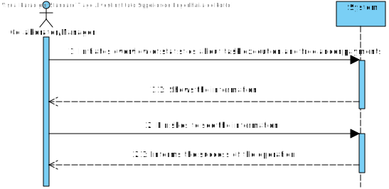
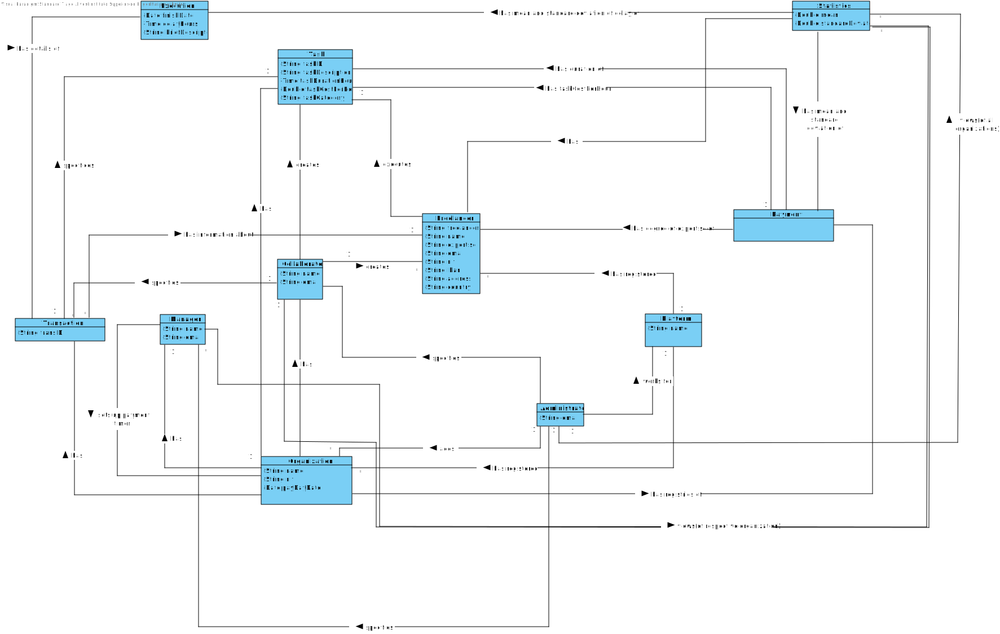
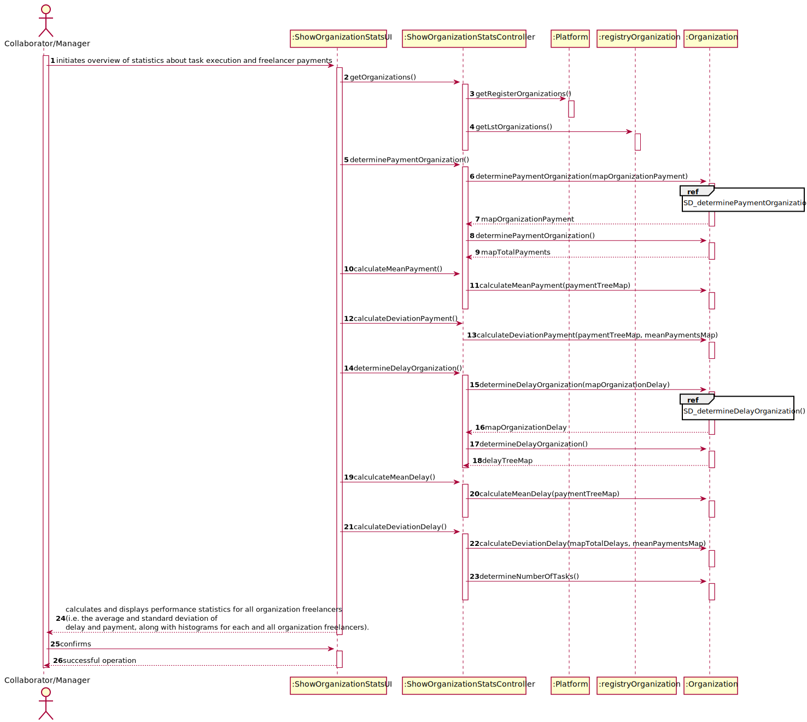
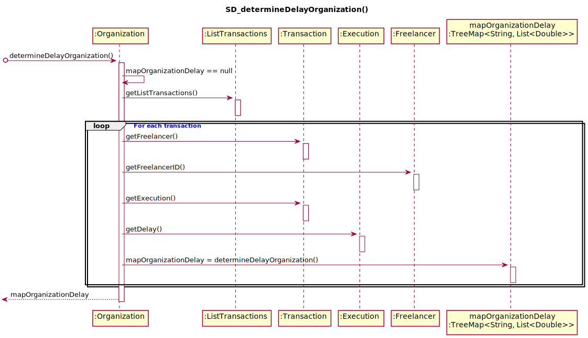
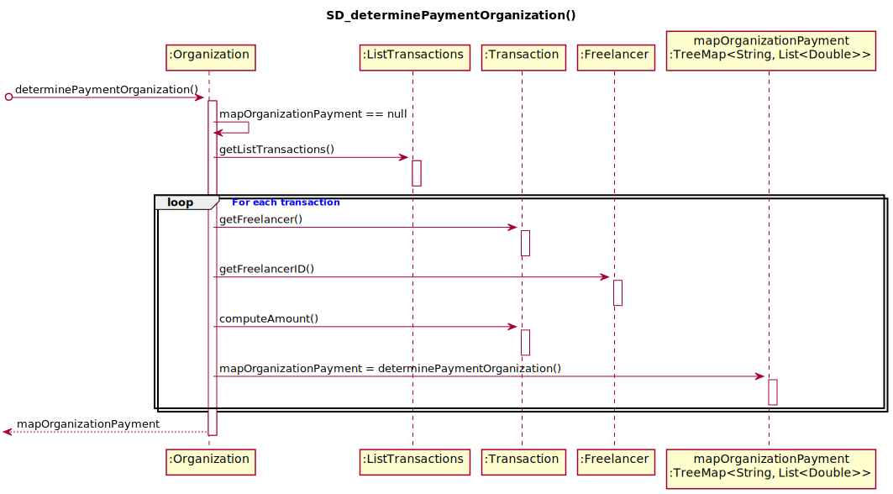
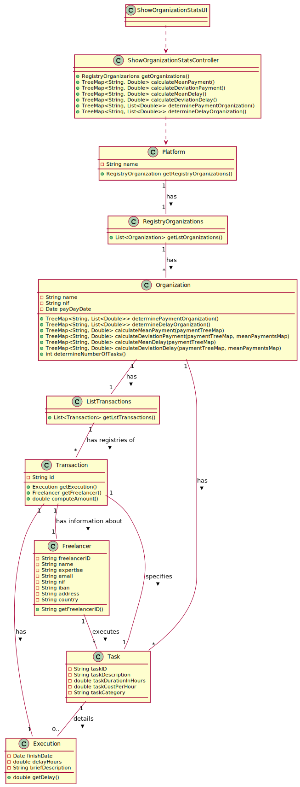

# UC7 - Organization Payments

## 1. Requirements Engineering

### Brief Format

The Collaborator or the Manager initiates overview of statistics about task execution and freelancer payments. The System confirms initiation and asks how he wants to sort the freelancers(name or payment value) . The Collaborator or the Manager chooses the type of sort. The System shows the information. The Collaborator or the Manager finishes to see the information. The System informs the success of the operation.

### SSD

### Full Format

#### Main Actor

Manager
Collaborator

#### Interested parts and their interests
* **Manager:** Intends to see an overall statistics about execution times and freelancer payments.
* **Collaborator:** Intends to see an overall statistics about execution times and freelancer payments.

#### Preconditions
n/a

#### Postconditions
The information is known by the Collaborator and Administrator.

### Main success scenario (or basic flow)

1. The Collaborator or the Manager initiates overview of statistics about task execution and freelancer payments.
2. The System shows the information.
3. The Collaborator or the Manager finishes to see the information.
4. The System informs the success of the operation.

#### Extensions (or alternative flows)

a. Collaborator or the Manager asks for cancelation of the overview of the statistics.

> Use Case ends.

#### Special Requirements
\-

#### List of Technolagies and Data Variations
\-

#### Occurance Frequency
\-

#### Open Questions

## 2. OO Analysis

### Excerto do Modelo de Domínio Relevante para o UC

## 3. Design - Use Case Realization

### Rational

| Main Flow | Question: Which Class... | Answer  | Justification  |
|:--------------  |:---------------------- |:----------|:---------------------------- |
| 1. The Collaborator or the Manager initiates overview of statistics about task execution and freelancer payments.| ...interacts with the Collaborator or the Manager? | ShowOrganizationStatsUI  | Pure Fabrication, because it is not justified to assign this responsibility to any class that exists in the Domain Model. |
|                                             | ...coordinates the UC? |  ShowOrganizationStatsController | Controller |
| 2.The System confirms initiation and asks how he wants to sort the freelancers(name or payment value) .|...is responsible for calculating the mean and the standard deviation of delay for all freelancers? | Organization |By the application of the Information Expert it would be the Platform. But by applying HC + LC, the Platform delegates that responsibility to the Organization. |
|                                             |...knows Organization? | Platform | IE: According to the MD the Platform has registered Organization |
|                                             |...is responsible for calculating the mean and the standard deviation of payment for all freelancers? | Organization |By the application of the Information Expert it would be the Platform. But by applying HC + LC, the Platform delegates that responsibility to the Organizations. |
|                                             |...knows Organization? | Platform | IE: According to the MD the Platform has registered Organization |
|                                             |...knows the delay in executing the task? | Execution | IE: has its own data  |
|                                             |...knows the class Execution? | Task | IE: According to the MD Task details Execution |
|                                             |...knows the value of the payment? | Transaction | IE: has its own data |
|                                             |...knows all payments made by an organization to a freelancer? | ListTransactions | By the application of the Information Expert it would be the Organization. But by applying HC + LC, the Organization delegates that responsibility to the ListTransactions. |
| 3. The Collaborator or the Manager finishes to see the information.| | | |
| 4. The System informs the success of the operation. | | | |

### Systematization ##

 From rational follow the conceptual classes promoted to software classes are:

 * Plataform
 * Freelancer
 * Organization
 * Task
 * Transaction
 * Execution

Other software classes (i.e. Pure Fabrication) identified:  

 * ShowOrganizationStatsUI
 * ShowOrganizationStatsController
 * ListTransactions

###	Sequence Diagram

#### Secondary Sequence Diagrams

###	Class Diagram

