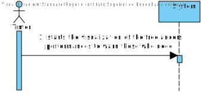
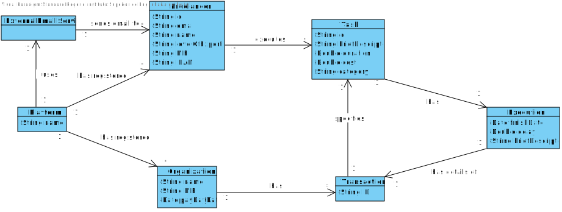
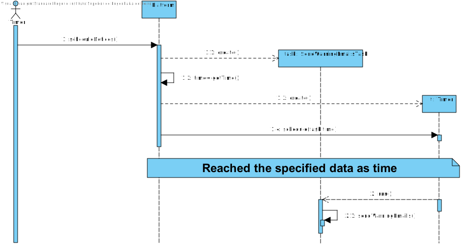
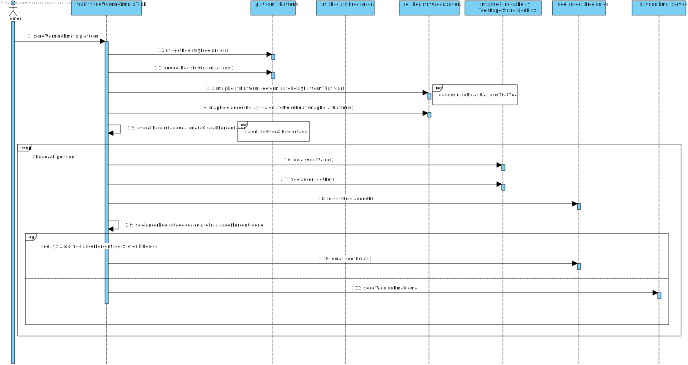
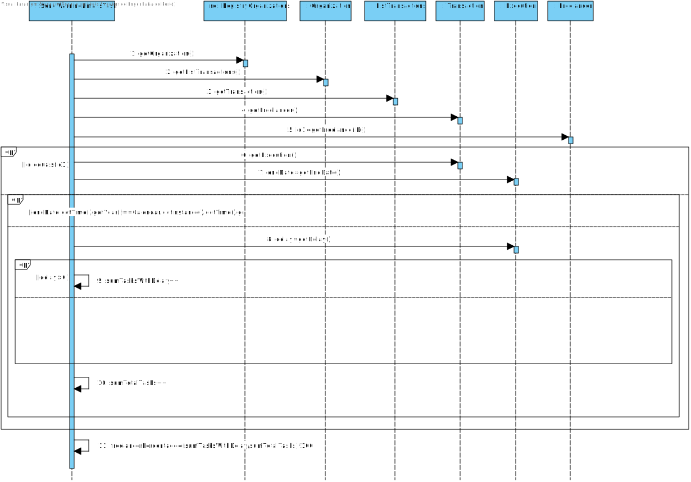
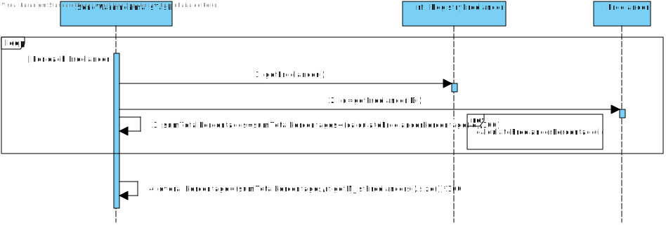
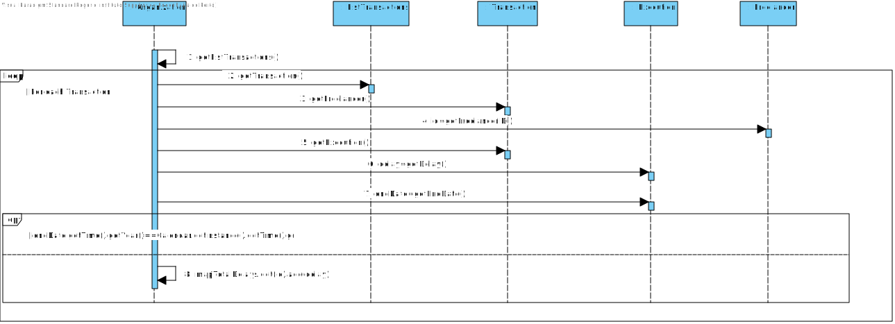
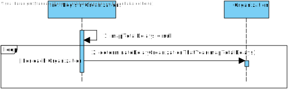
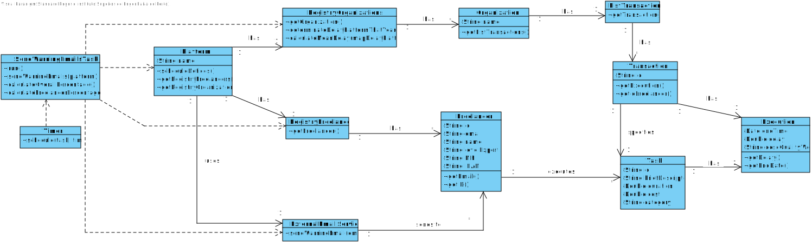

# UC1 - Register Task

## 1. Requirements engineering

### Brief Format

The timer starts the visualization of the freelancers' performances to warn those who need.

### SSD

### Full Format

#### Main Actor

Timer

#### Stakeholders and their interests

* **Organization:** pretend to improve the Freelancers' work.
* **T4J:** pretend to send emails to warn the freelancers about their delay on work.

#### Preconditions

\-

#### Postconditions

* The freelancer receives the email.

### Main success scenario (or basic flow)

1. The timer starts the visualization of the freelancers' performances to warn those who need.

#### Extensions (or alternative flows)

\-

#### Special requirements

\-

#### List of Technologies and Data Variations

\-

#### Frequency of Occurrence

\-

#### Open questions

\-

## 2. OO Analysis

### Excerpt from the Relevant Domain Model for UC

## 3. Design - Use Case Realization

### Rational

| Main Flow | Question: which class... | Answer  | Justification  |
|:--------------  |:---------------------- |:----------|:---------------------------- |
| 1. The timer starts the visualization of the freelancers' performances to warn those who need.	 |	... coordinates the UC?	| SendWarningEmailsTask | Task    |
| | ... knows the Freelancers? | Platform | IE: on MD Platform has Freelancer. |
| |	 | RegistryFreelancers | IE: by HC + LC Platform delegates RegistryFreelancers. |
| | | Freelancer |  IE: has its own data. |
| | ... knows the RegistryFreelancers? | Platform | IE: Platform has RegistryFreelancers. |
| | ... knows the Organizations? | Platform | IE: on MD Platform has Organization. |
| | | RegistryOrganizations | IE: by HC + LC Platform delegates RegistryOrganizations. |
| | | Organization | IE: has its own data. |
| | ... knows the RegistryOrganizations? | Platform | IE: Platform has RegistryOrganizations. |
| | ... knows the Transactions? | Organization | IE: on MD Organization has Transaction. |
| | | ListTransactions | IE: by HC + LC Organization delegates ListTransactions. |
| | | Transaction | IE: has its own data. |
| | ... knows the Executions? | Transaction | IE: on MD Transaction has Execution. |
| | | Execution | IE: has its own data. |
| | ... sends the email? | ExternalEmailService | Protected Variation |

          
### Systematization ##
 
It follows from the rational that the conceptual classes promoted to software classes are:

 * Platform
 * Freelancer
 * Organization
 * Transaction
 * Execution

Other software classes (i.e. Pure Fabrication) identified:  

 * SendWarningEmailsTask  
 * RegistryFreelancers
 * RegistryOrganizations
 * ListTransactions
 
Other classes of external systems / components:

* ExternalEmailService

### SD Partial

###	Sequence Diagram

### Reference calculateFreelancerPercentage(id)

### Reference calculateOverallPercentage()

### Reference determinateDelayOrganizationThatYear()

### Reference determinateDelayPlatformThatYear()

###	Class Diagram

