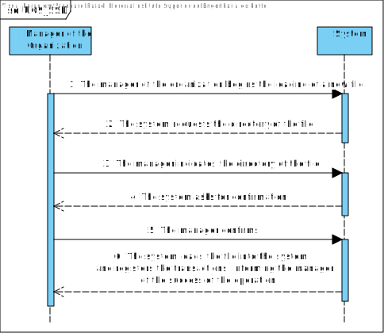
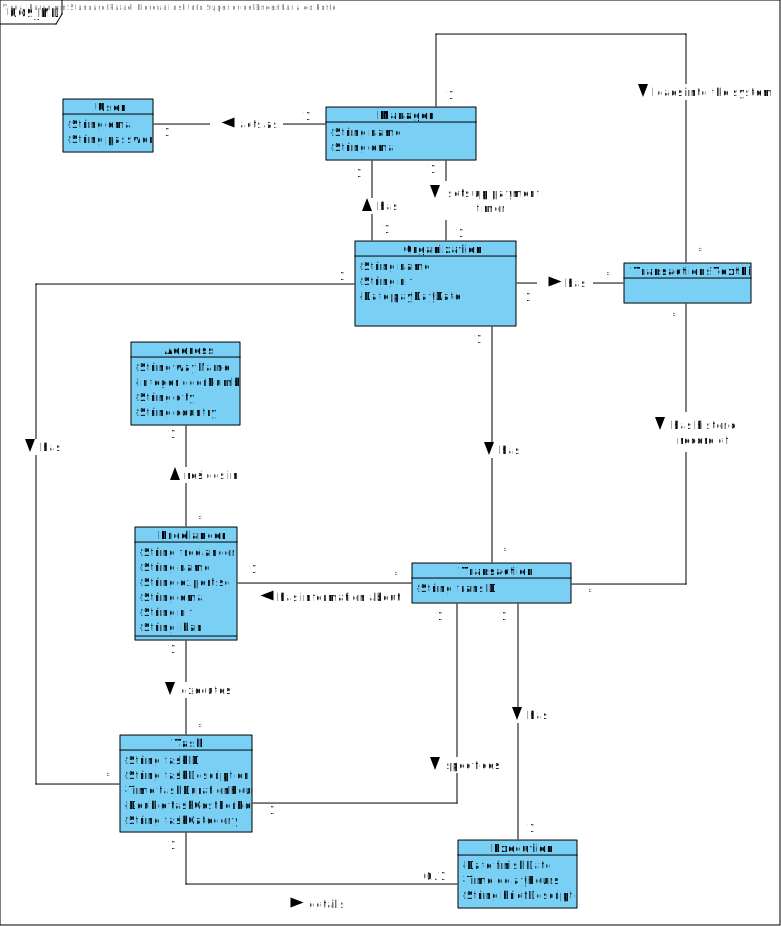
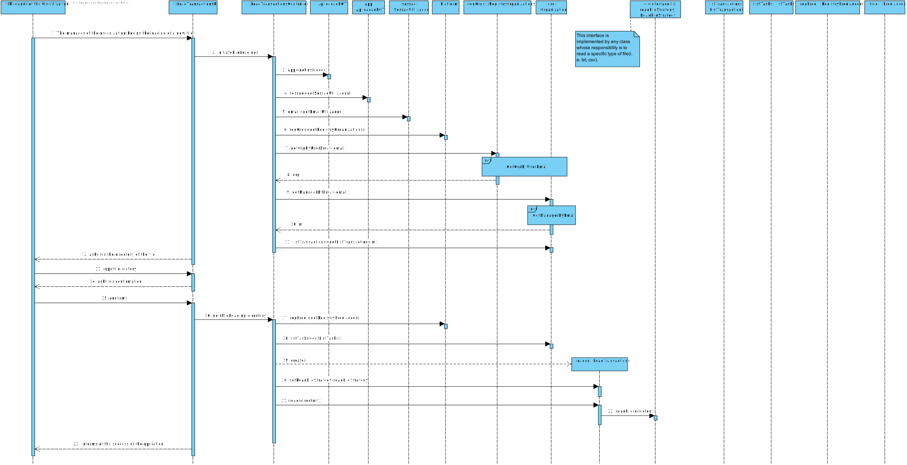
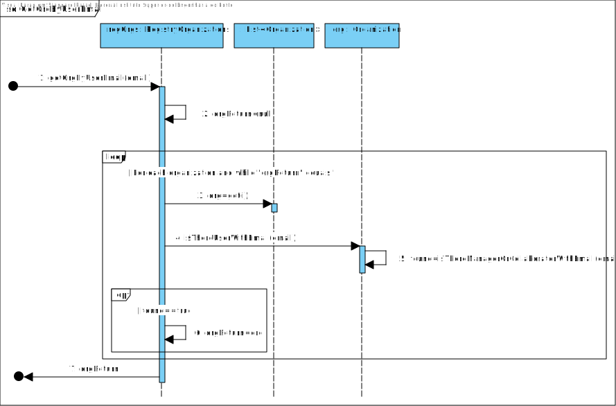
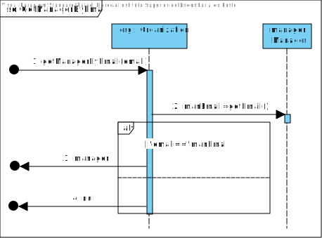
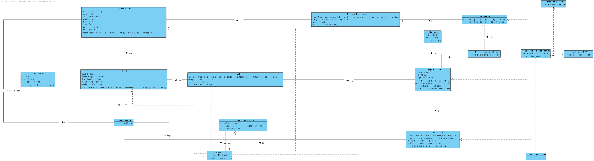
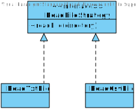

# UC 09 - Load Transactions from Text File

## 1. Requirements Engineering

### Brief Format

The manager of the organization begins the loading of a new text file.
The system requests the directory of the file.
The manager indicates the directory of the file.
The system asks for confirmation.
The manager confirms.
The system loads the file onto the system, reads the file and registers the transactions, informing the manager of the success of the operation.

### SSD

### Fully Dressed Format

#### Primary Actor

* Manager of the Organization

#### Stakeholders and Interests

* **Manager of the Organization:** intends to load the transactions from a text file onto the system.
* **T4J:** intends that the manager of the organization in question is able to load transactions from a text file
* **Organization:** intends to register transactions on the system.

#### Preconditions

- The file has to be in .txt or .csv format.
- The information about each transaction has to be on a separate line.
- The information about each transaction can't have any missing values.

#### Success Guarantees

- The transactions are registered onto the system.

#### Main Success Scenario

1. The manager of the organization begins the loading of a new text file.
2. The system requests the directory of the file.
3. The manager indicates the directory of the file.
4. The system asks for confirmation.
5. The manager confirms.
6. The system loads the file onto the system, **while the file has lines with information regarding the transactions**, reads each line from the file, creates and registers the transactions, **with the transaction ID, the task, the execution and the freelancer, along with its address**, informing the manager of the success of the operation.

#### Extensions

*a. The manager of the organization requests the cancellation of the loading of the transactions onto the system.
> The use case ends.

6a. System detects that the selected file has an invalid format.
>	1. The system alerts the manager for such fact.
>	2. The system asks for a new directory(step 3).
>	
	> 2a. The manager doesn't indicate a new directory for the file. Use case ends.

6b. System detects that a line in the file has missing values.
>	1. The system alerts the manager for such fact.
>	2. The system advances to the next line.
	
6c. System detects that the file has a line with too many values.
>	1. The system alerts the manager for such fact.
>	2. The system advances to the next line.
	
6d. System detects that a value in the file has an invalid format.
>	1. The system alerts the manager for such fact.
>	2. The system advances to the next line.

6e. System detects that the transaction already exists in the system.
>	1. The system alerts the manager for such fact.
>	2. The system advances to the next line.

6f. System detects that the task already exists in the system.
>   1. The system gets the task and adds it to the transaction.

6g. System detects that the freelancer already exists in the system.
 >   1. The system gets the freelancer and adds it to the transaction.
	
#### Special Requirements

\-

#### Technology and Data Variations List

\-

#### Frequency of Occurrence

\- 

#### Miscellaneous

- WHat is the frequency of ocurrence of this use case?

## 2. OO Analysis

### UC Relevant Domain Model Excerpt

## 3. Design - Use Case Realization

### Rationale

| Main Flow | Question : Which class... | Answer  | Justification  |
|:--------------  |:---------------------- |:----------|:---------------------------- |
|1. The manager of the organization begins the loading of a new text file.| ...interacts with the manager? | LoadTransactionsUI | Pure Fabrication : there are no suitable classes in the Domain Model to attribute this responsibility to.|
|| ... coordinates the use case? | LoadTransactionsController | Controller |
|| ... creates instances of Transaction?| ListTransactions | By the MD it would be the Organization but, by the High Cohesion(HC) + Low Coupling(LC) patterns, Organization assigns this responsibility to ListTransactions.|
|| ... knows ListTransactions? | Organization | IE |
|| ... knows ListTransactions? | Organization | IE |
|2. The system requests the directory of the file.| ... is responsible for reading and loading the file into application? | LoadTransactions | By the MD it would be the Organization but, by the High Cohesion+ Low Coupling patterns, Organization assigns this responsibility to LoadTransactions. |
|| ... knows LoadTransactions? | Organization | IE: Organization has LoadTransactions. |
|3. The manager indicates the directory of the file.| ... stores the chosen directory?| LoadTransactions | By the MD it would be the Organization but, by the High Cohesion+ Low Coupling patterns, Organization assigns this responsibility to ListTransactions.|
|4. The system asks for confirmation.|
|5. The manager confirms.|
| 6. The system loads the file onto the system, **while the file has lines with information regarding the transactions**, reads each line from the file, checking if the information already exists in the system, creates and registers the transactions, **with the transaction ID, the task, the execution and the freelancer, along with its address**, informing the manager of the success of the operation. | ... checks the file for information? | File | Pure Fabrication |
|| ... stores the transactionID? | Transaction  | IE |
|| ... checks if a transaction with the same ID already exists? | ListTransactions | By the MD it would be the Organization but, by the High Cohesion+ Low Coupling patterns, Organization assigns this responsibility to ListTransactions.|
|| ... creates instances of Task? | ListTasks | By the MD it would be the Organization but, by the High Cohesion+ Low Coupling patterns, Organization assigns this responsibility to ListTasks.|
|| ... stores the instance of Task created? | Transaction | IE: In the domain model, Transaction specifies Task. |
|| ... validates the instance of Task created(local validation)? | Task | IE: has its own data. |
|| ... validates the instance of Task created(global validation)? | ListTasks | IE: has all tasks. |
|| ... creates instances of Execution? | Task | IE |
|| ... stores the instance of Execution created? | Transaction | IE: In the domain model, Transaction details Execution. |
|| ... creates instances of Freelancer? | RegistryFreelancers | By the MD it would be the Company. But, by the HC+LC pattern, Company delegates this responsibility to RegistryFreelancers.|
|| ... validates the instance of Freelancer created(local validation)? | Freelancer | IE: has its own data. |
|| ... validates the instance of Freelancer created(global validation)? | RegistryFreelancers | IE: has all Freelancers. |
|| ... creates instances of Address? | Freelancer | IE: Freelancer resides in Address. |
|| ... validates the instance of Address created(local validation)? | Freelancer | IE:has its own data. |
|| ... validates the instance of Transaction created(local validation)?| Transaction | IE: has its own data. |
|| ... validates the instance of Transaction created(global validation)?| ListTransactions  | IE: has all transactions. |

### Sistematization ##

 Of the rationale it results that the conceptual classes promoted to software classes are:

 * Transaction
 * Task
 * Execution
 * Freelancer
 * Address
 * Platform
 * Organization

 Other software classes(i.e. Pure Fabrication) identified:  

 * LoadTransactionsUI
 * LoadTransactionsController
 * LoadTransactions
 * File
 * RegistryFreelancers
 * RegistryOrganizations
 * ListTransactions
 * ListTasks

###	UC9_SD_LoadTransactions

#### GetOrgByUserEmail

#### GetManagerByEmail

###	UC9_CD_LoadTransactions

####	UC9_CD_ReadFile

